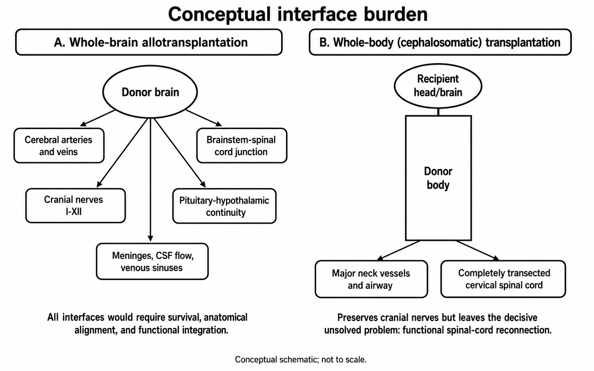

# Brain Transplantation: Scientific Feasibility, Translational Barriers, Ethical Constraints, and a Responsible Research Roadmap

**Author:** SAMUELSON G  
**Affiliation:** Independent Researcher  
**Document type:** Critical narrative review and conceptual feasibility analysis  
**Status:** Preprint / not peer reviewed

[](https://doi.org/10.13140/RG.2.2.13830.13124)  
[](https://zenodo.org/records/22692328)  
[](https://www.academia.edu/175330723/Brain_Transplantation_Scientific_Feasibility_Neurobiological_Barriers_Ethical_Constraints_and_a_Responsible_Research_Roadmap)  
[](https://creativecommons.org/licenses/by/4.0/)

---

## Overview

This repository contains a research paper examining the scientific feasibility, biomedical barriers, ethical concerns, and responsible research requirements associated with proposed brain transplantation and whole-body or cephalosomatic transplantation.

The paper does **not** claim that human brain transplantation is currently possible. No validated human procedure has demonstrated successful whole-brain transplantation, complete cervical spinal-cord reconnection, durable neurological integration, or acceptable long-term clinical outcomes.

Instead, the study critically evaluates the separate technical problems that would need to be solved before such a procedure could be considered scientifically or ethically plausible.

## Research Objectives

The paper addresses the following questions:

1. What is meant by whole-brain transplantation, head transplantation, and cephalosomatic transplantation?
2. What evidence exists from historical animal experiments and modern organ-preservation research?
3. Can the brain survive removal, preservation, reperfusion, and reconnection without irreversible injury?
4. What barriers prevent functional spinal-cord reconnection?
5. How would cranial nerves, cerebral vessels, cerebrospinal-fluid pathways, autonomic regulation, and endocrine systems be integrated?
6. What immunological, ethical, legal, and identity-related problems would arise?
7. What responsible component-level research could be pursued without prematurely attempting transplantation?

## Key Findings

- No successful human whole-brain or whole-body transplantation has been demonstrated.
- Historical cephalic-exchange experiments achieved only temporary vascularized head survival and did not restore spinal-cord function.
- Modern perfusion studies have shown that selected cellular and metabolic processes can sometimes be partially restored after prolonged ischaemia, but this is not equivalent to restoring consciousness or integrated brain function.
- Complete cervical spinal-cord reconnection remains the most decisive unresolved technical barrier.
- Neurovascular preservation, cranial-nerve integration, endocrine continuity, cerebrospinal-fluid circulation, immune rejection, infection, chronic pain, and autonomic instability represent additional major barriers.
- The ethical problems include consent, personal identity, donor-recipient status, suffering, death determination, resource allocation, and the risk of premature human experimentation.
- Research should proceed only through tightly governed, component-based studies with predefined safety and stopping criteria.

## Figures

### Figure 1 — Conceptual Interface Burden

Compares the number and complexity of biological interfaces involved in:

- whole-brain allotransplantation; and
- whole-body or cephalosomatic transplantation.



### Figure 2 — Evidence-to-Translation Maturity Ladder

Shows the gap between demonstrated tissue-preservation research and the much higher requirements for integrated human transplantation.


### Figure 3 — Responsible Component-Research Roadmap

Presents a phased research pathway with ethical and functional gates that must be satisfied before any escalation.


## Repository Structure

```text
brain-transplantation-review/
├── README.md
├── LICENSE
├── CITATION.cff
├── manuscript/
│   ├── Brain_Transplantation_Critical_Review_SAMUELSON_G.pdf
│   └── Brain_Transplantation_Critical_Review_SAMUELSON_G.docx
├── figures/
│   ├── figure1_interfaces.png
│   ├── figure2_maturity.png
│   └── figure3_roadmap.png
└── supplementary/
    └── references-or-supporting-materials
```

## Methodological Scope

This work is a critical narrative review and conceptual synthesis. It integrates evidence from:

- transplantation medicine;
- neuroscience and neurocritical care;
- spinal-cord injury research;
- cerebral perfusion and organ preservation;
- immunology;
- bioethics;
- legal and identity scholarship; and
- historical animal experimentation.

The paper does not report original human or animal experiments, clinical outcomes, or a tested surgical protocol.

## Conclusion

Brain transplantation remains beyond current scientific and clinical capability. The principal obstacle is not simply maintaining cerebral blood flow, but restoring coordinated communication between the brain, spinal cord, peripheral nervous system, endocrine system, autonomic system, and donor body while also preventing ischaemic injury, rejection, infection, severe disability, and unacceptable suffering.

Historical experiments demonstrate that short-term vascularized survival of a transplanted head is biologically different from functional transplantation. Modern advances in perfusion, neuroregeneration, neuromodulation, cell therapy, biomaterials, and organ preservation are scientifically important, but they do not yet establish complete spinal-cord reconnection or durable whole-organ neurological integration.

A responsible research strategy should therefore avoid premature human transplantation claims. Progress should be measured through independently reproducible component-level milestones, including safe brain preservation, validated neurophysiological monitoring, long-tract spinal conduction, integrated motor and autonomic recovery, manageable immunological risk, and robust ethical oversight.

Until those requirements are met, brain or whole-body transplantation should be regarded as a speculative research concept rather than an available or near-term clinical treatment.

## Ethical and Medical Disclaimer

This repository is provided for academic discussion and research purposes only.

It does not provide medical advice, surgical instructions, clinical recommendations, or authorization for experimentation. Any research involving human participants, animals, donated organs, neural tissue, or invasive procedures must receive appropriate institutional, legal, ethical, and regulatory approval.

## Citation

Cite the paper as:

> Samuelson G. *Brain Transplantation: Scientific Feasibility, Translational Barriers, Ethical Constraints, and a Responsible Research Roadmap*. Preprint.

### BibTeX

```bibtex
@article{samuelson_brain_transplantation,
  author  = {Samuelson, G.},
  title   = {Brain Transplantation: Scientific Feasibility, Translational Barriers, Ethical Constraints, and a Responsible Research Roadmap},
  journal = {Preprint},
  year    = {2026},
  doi     = {https://doi.org/10.13140/RG.2.2.13830.13124},
  url     = {https://github.com/Samuelson777/Brain-Transplantation/}
}
```

## Author

**SAMUELSON G**  
Independent Researcher
gsamuelsonguna@gmail.com

## License

An open-access license for this repository is the **Creative Commons Attribution 4.0 International License (CC BY 4.0)**.

Under CC BY 4.0, others may share and adapt the work, provided they give appropriate credit.

## Acknowledgment

This project is intended to encourage evidence-based discussion of an extraordinary and highly speculative medical concept while clearly separating established science from experimental findings, theoretical proposals, and unsupported claims.
